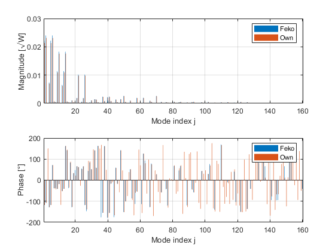
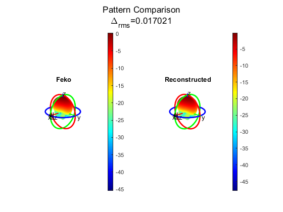
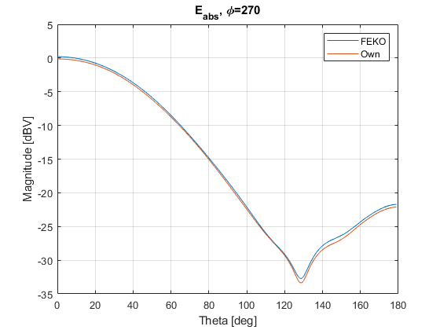

# Spherical Vector Wave Expansion

Implementation of the Spherical (Vector) Wave Expansion (SWE) following FEKO definition.
Additionally, [these](https://www.semanticscholar.org/paper/Calculating-Far-Field-Radiation-Based-on-FEKO-Wave-Sutinjo/4ad02a14898fc24cddc71ae0b2b457149764e51e) derivations are used for numerical stability.

A far-field, vector electric field is used as input. The normalization used will produce the same mode magnitudes/phase as FEKO. 

Overall reconstruction error stays below 5% for most applications. Addiitonal testing is needed to see the behaviour for large number of modes and for modes with low magnitudes

